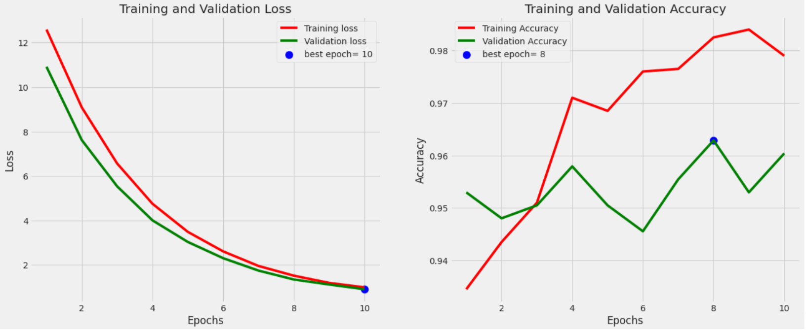

# ChickenDiseaseApp
### Introduction to Chicken Fecal Image Classification Problem:

In the realm of poultry farming and livestock management, the detection and diagnosis of diseases in chickens play a crucial role in ensuring the health and well-being of these avian creatures. One of the essential indicators of a chicken's health is the examination of its fecal matter. The analysis of chicken fecal images has emerged as an innovative and valuable tool for poultry farmers, veterinarians, and researchers in identifying various diseases and health-related issues in poultry flocks.

Chicken fecal image classification is a challenging problem that involves leveraging image processing, computer vision, and machine learning techniques to categorize and diagnose health conditions in chickens based on the visual characteristics of their fecal samples. The objective is to develop a robust and accurate system that can automatically classify fecal images into different disease categories or health states.

The significance of this problem lies in its potential to revolutionize the poultry industry by offering several benefits:

1. **Early Disease Detection:** Automated image classification can help detect diseases or infections in chickens at an early stage, allowing for timely intervention and treatment.

2. **Improved Farm Management:** Farmers can make informed decisions regarding flock health, vaccination strategies, and overall management practices based on real-time data from fecal image analysis.

3. **Reduced Manual Labor:** Automating the classification process reduces the reliance on manual labor for fecal sample analysis, making it more efficient and cost-effective.

4. **Preventive Measures:** By identifying disease trends and patterns, preventive measures can be implemented to reduce the risk of disease outbreaks.

5. **Research and Data Analytics:** Fecal image classification provides valuable data for researchers to study the prevalence and evolution of diseases in poultry populations.

**Dataset:**

This dataset was taken from kaggle. It is a comprehensive dataset of chicken fecal images, including samples with 'Salmonella,' 'New Castle Disease,' and 'Coccidiosis.' The dataset was carefully curated and labeled to ensure accuracy and reliability in disease classification.The poultry fecal images were taken in Arusha and Kilimanjaro regions in Tanzania between September 2020 and February 2021 using Open Data Kit (ODK) app on mobile phones. The images are resized to 224px by 224px. 
This dataset contains 33% salmonella, 31 % coccidiosis and remaining consitute of healthy and new castle disease. 

Dataset is imbalanced with 60% data belonging to two labels. So to balance trainind data we are limiting maximum samples to 500 samples

## **Training**
**Image Preprocessing:**
Effective preprocessing is crucial for improving the performance of any image classification model. In our project, we followed these key preprocessing steps:

1. Data Augmentation: Data augmentation techniques, such as random rotation, flipping, and brightness adjustments, were applied to increase the diversity of the training dataset and improve model generalization.

2. Normalization: Image pixel values were normalized to have a mean of 0 and a standard deviation of 1. This step helps in stabilizing the training process.

**Model Architecture:**
We employed the EfficientNetB7 architecture, a state-of-the-art convolutional neural network (CNN) known for its exceptional efficiency and accuracy. This model has a powerful feature extraction capability and can handle complex image classification tasks effectively.
The model was trained using a supervised learning approach. The dataset was split into training, validation, and test sets. The training set was used to optimize the model's weights, while the validation set helped in monitoring the training progress and preventing overfitting. The test set was used to evaluate the model's performance.

**Evaluation Metrics:**
To assess the performance of our model, we used standard classification metrics, including accuracy, precision, recall, F1-score, and confusion matrices. These metrics provide a comprehensive understanding of the model's ability to differentiate between the three disease categories.

### **Training and Validation Loss, Accuracy**

### **Confusion Matrix**

### **Classification Report**
 

It demonstrates high precision, recall, and F1-scores for most classes, suggesting that the model is effective in identifying and differentiating between 'Coccidiosis,' 'Healthy,' 'New Castle Disease,' and 'Salmonella.' Additionally, the high accuracy and balanced macro-average metrics further validate the model's overall performance.
                 
**Results:**
Our model demonstrated remarkable accuracy in classifying chicken fecal images into the specified disease categories. The EfficientNetB7 architecture, combined with proper preprocessing and data augmentation, enabled us to achieve high precision and recall rates. The results indicate the potential of automated fecal image classification for disease diagnosis in poultry farming.

**Conclusion:**

In conclusion, our project successfully utilized the EfficientNetB7 model to classify chicken fecal images into 'Salmonella,' 'New Castle Disease,' and 'Coccidiosis' categories. The careful preprocessing of images and the power of the model architecture contributed to the excellent performance observed in disease classification. This approach has the potential to revolutionize poultry health management by enabling early disease detection and informed decision-making for farmers and veterinarians. Further research and real-world implementation can enhance the impact of this technology on poultry farming practices.

**Depoyment:**
the whole project is made to show case how to make modular code and different pipeline. Flask has been used for study purpose. Actual app made and deployed using Streamlit

[Click for app]()